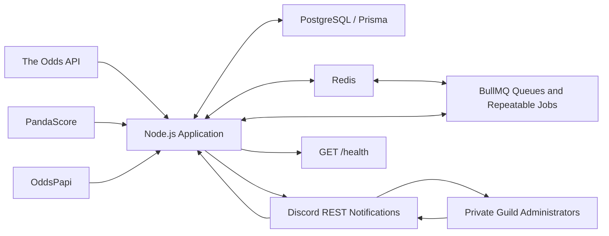
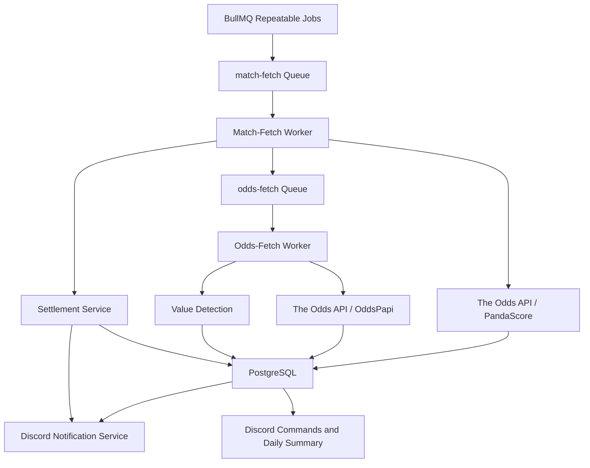
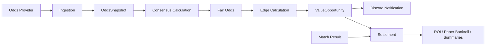
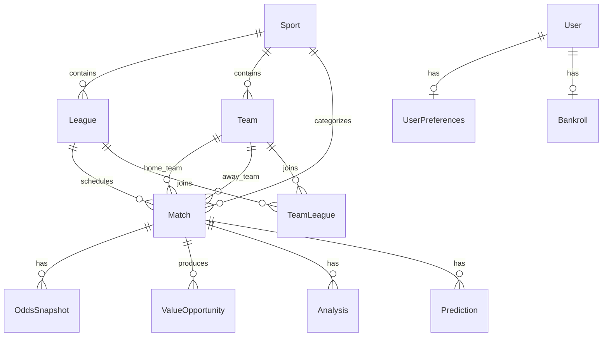

# Project Knowledge Transfer

**Repository:** `betting-intelligence`

**Audit date:** 2026-06-10

**Audit basis:** Current source code, Prisma schema and migrations, package scripts, configuration, root documentation, and existing audit documents.

**Authority rule:** Where documentation and code disagree, this report describes the current code.

# 1. Executive Summary

## What This Project Is

This project is a single-process TypeScript service that continuously ingests sports and esports match data and bookmaker odds, detects potential value bets, publishes alerts to a private Discord server, settles those paper bets after results become available, and reports performance in units and ROI.

The current product is an automated value-bet alerting and paper-tracking system. It does not place real bets. It also does not currently implement the broader AI-assisted, personalized betting platform described in some older repository documents.

## Business Problem

Bookmaker prices differ. The system attempts to identify cases where Pinnacle offers a higher price than a consensus implied by other available bookmakers. It automates the otherwise manual work of:

1. Monitoring many competitions and providers.
2. Comparing Pinnacle with the rest of the observed market.
3. Alerting users quickly when the calculated edge clears a threshold.
4. Recording the opportunity and its eventual result.
5. Measuring hypothetical performance using a flat one-unit paper stake.

## Intended Users

The implemented product is intended for the operator and administrators of one private Discord guild. All slash commands are administrator-only. Repository documentation describes a friends-only deployment for approximately five users, but the active metrics and paper bankroll are global rather than per-user.

## Current Maturity

**Assessment: late beta / production pilot, not production-ready.**

The core pipeline is implemented end to end:

- Scheduled ingestion
- Odds snapshot storage
- Value detection
- Discord value alerts
- Result ingestion
- Settlement
- ROI and summary reporting

Existing audit records indicate that value alerts and settlement traces have operated against real providers. However, this audit did not verify a live deployment, and the current repository does not pass its production TypeScript build, test command, or lint command. Several operational and data-quality risks remain material.

# 2. System Overview

## Architectural Shape

The application is a modular monolith running in one Node.js process. It contains the HTTP health endpoint, Discord bot, schedulers, BullMQ workers, provider clients, business services, and repositories.



## Application Startup

`src/main.ts` loads configuration once, creates the logger, installs process-level error handlers, and starts `Application`.

The application then:

1. Connects Prisma to PostgreSQL.
2. Connects to Redis and verifies it with `PING`.
3. Creates BullMQ queues.
4. Creates provider clients, repositories, services, and workers.
5. Installs real processors for match and odds queues.
6. Starts workers.
7. registers repeatable jobs.
8. Logs into Discord and registers guild slash commands.
9. Starts the HTTP health endpoint on `0.0.0.0:${PORT}`.

PostgreSQL and Redis are hard startup dependencies. Discord startup failure is logged but does not stop the service.

## Major Subsystems

### Discord Bot

The Discord bot provides administrator-only operational and reporting commands. It also sends:

- Value opportunity alerts
- Settlement outcome notifications
- Daily performance summaries
- A startup-time presence string

Discord is the primary user interface. There is no web application or public application API.

### Value Detection

Value detection reads the latest non-live head-to-head odds snapshots for selected matches. It treats Pinnacle as the candidate bookmaker and uses every non-Pinnacle snapshot row as the consensus. Qualifying opportunities are persisted before Discord notification.

### Settlement

Settlement refreshes match results from The Odds API and PandaScore, then settles every unresolved `ValueOpportunity` attached to a finished match. Performance uses a flat one-unit paper stake.

### Queue System

BullMQ coordinates scheduled and manually requested work. Redis stores the queue state, repeatable schedules, delayed jobs, esports cooldowns, and an OddsPapi quota counter.

### Database

PostgreSQL is the system of record. Prisma provides the schema and runtime data access. Match data, odds history, value opportunities, and settlement results are durable in PostgreSQL.

### Redis

Redis is operational state rather than business truth. Losing Redis loses queued work, repeatable job metadata, cooldowns, and counters, but not the PostgreSQL history.

### APIs

The application consumes three sports-data providers:

- The Odds API for traditional sports, odds, reference data, and scores
- PandaScore for esports matches and results
- OddsPapi for esports bookmaker odds

The only implemented HTTP endpoint exposed by this service is `GET /health`.

### Scheduled Jobs

BullMQ repeatable jobs drive reference sync, traditional and esports match ingestion, settlement, and daily summaries. Odds ingestion is usually triggered by a match-ingestion job rather than directly scheduled.

## Interaction Summary



# 3. End-to-End Data Flow

## Complete Lifecycle



## Traditional Sports Flow

1. A repeatable `sync-traditional-sport` job enters `match-fetch`.
2. `MatchIngestionService` calls The Odds API odds endpoint for the configured sport key.
3. The request asks for regions `eu,us,uk`, markets `h2h,spreads,totals`, and decimal odds.
4. The response is mapped into canonical sports, leagues, teams, matches, and an odds plan.
5. The match-ingestion path persists reference and match entities, but does not persist the odds plan returned by this call.
6. Matches starting within 48 hours are queued for a separate traditional odds sync after a five-second delay.
7. `OddsSnapshotService` calls The Odds API again for the selected event IDs, requesting non-live `h2h` odds.
8. Each bookmaker, market, and outcome becomes an append-only `OddsSnapshot`.
9. If snapshots were inserted, value detection runs for the requested matches.
10. Pending opportunities are sent to Discord.

Traditional match external IDs are prefixed `oa:`. Team IDs are synthesized from normalized team names within a sport. League external IDs are the configured The Odds API sport keys.

## Esports Flow

1. A repeatable `sync-esports-game` job enters `match-fetch`.
2. PandaScore upcoming and running endpoints are queried for the configured game.
3. Results are paginated, deduplicated by PandaScore match ID, and filtered to matches with known teams and start times.
4. Sports, leagues, teams, and matches are persisted.
5. Matches starting within 48 hours are eligible for esports odds ingestion.
6. A per-game Redis cooldown suppresses repeated OddsPapi ingestion for four hours.
7. Eligible jobs enter `odds-fetch` after a five-second delay.
8. OddsPapi active tournaments and tournament odds are requested for Pinnacle, Bet365, and Unibet.
9. OddsPapi fixtures are correlated to PandaScore-backed database matches using normalized team names, aliases, and start-time proximity.
10. Matched head-to-head odds are inserted as non-live `OddsSnapshot` rows.
11. Value detection and Discord notification follow the same path as traditional sports.

Esports match external IDs are prefixed `ps:`. PandaScore numeric team and league IDs are stored as strings scoped by sport.

## Consensus, Fair Odds, and Edge Flow

For each requested match:

1. Read all non-live `h2h` snapshots.
2. Find the newest `capturedAt`.
3. Keep only snapshots from that exact timestamp.
4. Group snapshots by exact outcome text.
5. Select the first Pinnacle row as the candidate price.
6. Treat every non-Pinnacle row as a consensus observation.
7. Require at least two consensus rows.
8. Average the raw implied probabilities, where implied probability is `1 / decimalOdds`.
9. Invert that average to obtain fair odds.
10. Calculate Pinnacle edge.
11. Apply price, edge, validity, and cooldown filters.
12. Insert a `ValueOpportunity`.

## Discord Notification Flow

The notification service reads up to 50 oldest opportunities where `alertedAt` is null. It sends them sequentially to the required alert channel and then sets `alertedAt`.

If Discord sending fails, the opportunity remains pending. If Discord accepts a message but the subsequent database update fails, a later retry can send a duplicate alert.

## Match Result and Settlement Flow

1. The `settle-matches` repeatable job runs every four hours.
2. Traditional results are refreshed from The Odds API scores endpoint using `daysFrom=3`.
3. Esports results are refreshed from PandaScore past matches.
4. Matches are updated to `FINISHED` with scores and a result.
5. The settlement service finds unsettled opportunities attached to finished matches.
6. It maps the stored opportunity outcome to home team, away team, or draw.
7. It stores `WIN`, `LOSS`, or theoretically `PUSH`, plus profit/loss units and `settledAt`.
8. Newly settled results are sent to the optional Discord outcomes channel.

Unknown or unresolvable outcomes currently default to `LOSS`. The active outcome evaluator does not produce `PUSH`.

## ROI Flow

Every settled opportunity represents one paper unit:

- Win: `decimalOdds - 1` units
- Loss: `-1` unit
- Push: `0` units

`/roi`, `/paper-bankroll`, `/best-sports`, daily summaries, and Discord presence derive metrics directly from settled `ValueOpportunity` rows. There is no real wager or account reconciliation.

# 4. Core Business Logic

## What Defines a Value Bet

A value bet is a latest-timestamp, non-live, head-to-head Pinnacle price that:

- Has at least two non-Pinnacle consensus snapshot rows for the same exact outcome
- Has valid decimal odds greater than 1
- Does not exceed `MAX_ALERT_ODDS`
- Produces an edge of at least 5%
- Produces an edge no greater than 100%
- Has not already been alerted for the same match and outcome during the previous 12 hours

The target bookmaker is always Pinnacle.

## Fair Odds Calculation

For each non-Pinnacle consensus snapshot:

```text
implied probability = 1 / bookmaker decimal odds
```

The system takes the arithmetic mean of those raw implied probabilities:

```text
consensus probability = sum(implied probabilities) / number of snapshots
```

Fair odds are:

```text
fair odds = 1 / consensus probability
```

The calculation does not remove bookmaker margin or normalize probabilities across all outcomes. Therefore, "fair odds" in the current code are a market-consensus proxy, not margin-free fair odds.

## Edge Calculation

```text
edge percent = ((Pinnacle odds / fair odds) - 1) * 100
```

Equivalent form:

```text
edge percent = (Pinnacle odds * consensus probability - 1) * 100
```

Example:

```text
Consensus probability: 50%
Fair odds:              2.00
Pinnacle odds:          2.20
Edge:                   10%
```

## Filters

### Ingestion Filters

- Only matches within 48 hours are automatically sent to odds ingestion.
- Esports matches with TBD teams, non-team opponents, or no start time are skipped.
- Esports odds ingestion has a four-hour per-game Redis cooldown.
- Value detection only evaluates non-live `h2h` markets.
- Unknown markets are skipped during odds mapping.

### Value Filters

- Candidate bookmaker must be Pinnacle.
- At least two non-Pinnacle snapshot rows are required.
- Prices must be greater than 1.
- Pinnacle price must be at or below `MAX_ALERT_ODDS`, default `3.0`.
- Edge must be between 5% and 100%.
- Same match and outcome cannot alert again within 12 hours.

### Settlement Filters

- Opportunity must have `settledAt = null`.
- Associated match must be `FINISHED`.
- Associated match must have a non-null result.

## Sportsbooks

### Candidate Bookmaker

- Pinnacle

### Traditional Consensus Bookmakers

The Odds API response is requested for the `eu`, `us`, and `uk` regions. There is no explicit traditional-bookmaker whitelist. Every returned non-Pinnacle snapshot row is eligible for the consensus.

### Esports Bookmakers

OddsPapi requests:

- Pinnacle
- Bet365
- Unibet

Pinnacle is the candidate. Bet365 and Unibet are the intended esports consensus sources.

The display helper also recognizes 1xBet and Betway names, but this does not cause those bookmakers to be requested.

## Supported Sports

The scheduler configures **50 traditional sport/league keys** and **4 esports games**, matching the hardcoded Discord presence text of 54 sports.

### Traditional: Every 60 Minutes

- `icehockey_nhl`
- `baseball_mlb`
- `basketball_wnba`
- `soccer_usa_mls`
- `tennis_atp_wimbledon`
- `tennis_atp_us_open`
- `tennis_atp_indian_wells`
- `tennis_atp_miami_open`
- `tennis_wta_wimbledon`
- `tennis_wta_us_open`
- `tennis_wta_indian_wells`
- `tennis_wta_miami_open`

### Traditional: Every 4 Hours

- `basketball_nba`
- `soccer_epl`
- `soccer_uefa_champs_league`
- `americanfootball_ncaaf`

### Traditional: Every 3 Hours

- `soccer_brazil_serie_b`
- `soccer_argentina_primera_division`
- `soccer_australia_aleague`
- `soccer_austria_bundesliga`
- `soccer_brazil_campeonato`
- `soccer_belgium_first_div`
- `soccer_chile_campeonato`
- `soccer_china_superleague`
- `soccer_denmark_superliga`
- `soccer_england_league2`
- `soccer_finland_veikkausliiga`
- `soccer_france_ligue_two`
- `soccer_germany_bundesliga2`
- `soccer_germany_bundesliga_women`
- `soccer_germany_dfb_pokal`
- `soccer_germany_liga3`
- `soccer_greece_super_league`
- `soccer_italy_serie_b`
- `soccer_japan_j_league`
- `soccer_korea_kleague1`
- `soccer_league_of_ireland`
- `soccer_mexico_ligamx`
- `soccer_netherlands_eredivisie`
- `soccer_norway_eliteserien`
- `soccer_poland_ekstraklasa`
- `soccer_portugal_primeira_liga`
- `soccer_russia_premier_league`
- `soccer_spain_segunda_division`
- `soccer_saudi_arabia_pro_league`
- `soccer_spl`
- `soccer_sweden_allsvenskan`
- `soccer_sweden_superettan`
- `soccer_switzerland_superleague`
- `soccer_turkey_super_league`

### Esports

- `cs2`
- `valorant`
- `lol`
- `dota2`

The active provider keys still determine whether a configured sport actually returns data.

# 5. External Dependencies

| Dependency | Why It Exists | What It Provides | Failure Impact |
|---|---|---|---|
| The Odds API | Primary traditional-sports provider | Active sport reference data, traditional matches, bookmaker odds, and scores | Traditional discovery, odds updates, and settlement stop for affected cycles. Existing PostgreSQL data remains available. |
| OddsPapi | Esports odds provider | Active tournaments and H2H odds for Pinnacle, Bet365, and Unibet | PandaScore matches can still ingest, but no new esports odds or esports value opportunities are produced. |
| PandaScore | Esports match provider | Upcoming, running, and past esports matches plus teams, leagues, schedules, scores, and results | Esports discovery and settlement stop. Existing esports odds cannot be reliably attached to fresh match truth. |
| Discord | User interface and alert transport | Guild slash commands, value alerts, settlement notifications, daily summaries, and presence | Ingestion and settlement continue. Value alerts remain pending when sends fail; settlement notifications can be lost after settlement. |
| PostgreSQL | Durable system of record | Canonical entities, matches, append-only odds history, opportunities, alerts, and settlement records | Application startup fails or runtime operations fail. The system cannot process safely without it. |
| Redis | Queue and ephemeral operational state | BullMQ state, schedules, delayed work, cooldowns, and quota counter | Application startup fails and all scheduled/background processing stops. PostgreSQL business records remain intact. |
| BullMQ | Background execution and scheduling abstraction | Queues, workers, repeatable jobs, delays, and job lifecycle state | No ingestion, settlement, or daily summary jobs run. |

## Dependency Notes

- Production factories currently return the default The Odds API and PandaScore clients. Resilient client decorators exist but are not wired into the runtime.
- OddsPapi's Redis quota counter increments once per logical game request, while one logical request can issue multiple tournament/bookmaker HTTP calls. It does not represent actual request count.
- Discord login failure is intentionally nonfatal.
- DeepSeek is present in configuration and older product documentation, but no active AI integration uses it.

# 6. Database Model Analysis

## Relationship Overview



## Match

`Match` is the central canonical event entity.

It stores:

- Provider-derived external ID
- Sport, league, home team, and away team relationships
- Start time and status
- Home and away scores
- Result
- Last-fetch timestamp

Traditional IDs use the `oa:` prefix. Esports IDs use the `ps:` prefix. `externalId` is globally unique.

A match owns many odds snapshots, analyses, predictions, and value opportunities.

## OddsSnapshot

`OddsSnapshot` is an append-only observation of one bookmaker price for one match, market, and outcome at one time.

Important fields include:

- `matchId`
- `bookmaker`
- `market`
- `outcome`
- Decimal `price`
- `isMain`
- `isLive`
- `capturedAt`

There is no uniqueness constraint or database-level deduplication for snapshots. Historical snapshots accumulate indefinitely.

## ValueOpportunity

`ValueOpportunity` is the active business record for detected and paper-tracked value bets.

It stores:

- Match relationship
- Denormalized sport
- Candidate bookmaker and outcome
- Candidate odds
- Calculated fair odds
- Edge percentage
- Consensus probability and bookmaker names
- Snapshot capture time
- Alert timestamp
- Settlement timestamp
- Bet result
- Profit/loss units

The unique key is:

```text
(matchId, bookmaker, outcome, capturedAt)
```

This prevents an identical opportunity for the same timestamp from being inserted twice. It does not replace the 12-hour alert suppression rule, which is evaluated separately.

## Settlement-Related Entities

There is no separate settlement table. Settlement state lives on:

- `Match`: final status, scores, and result
- `ValueOpportunity`: `settledAt`, `betResult`, and `profitLossUnits`

The `BetResult` enum supports `WIN`, `LOSS`, and `PUSH`, although the active evaluator does not currently return `PUSH`.

## Other Entities

### Sport

Canonical sport/category record. It owns leagues, teams, and matches. The runtime scheduler uses hardcoded keys rather than reading enabled sports from this table.

### League

Canonical competition within a sport. Unique by `(sportId, externalId)`.

### Team

Canonical participant within a sport. Unique by `(sportId, externalId)`.

### TeamLeague

Many-to-many relationship between teams and leagues.

### User, UserPreferences, and Bankroll

These models support an intended personalized product but are dormant in the active runtime. Discord commands and metrics do not use them.

### Analysis and Prediction

These models support the older AI/prediction vision but are dormant. The AI queue processor is also a placeholder.

## Migration History

The repository contains four migrations:

1. Base schema
2. `ValueOpportunity`
3. `alertedAt`
4. Settlement fields

# 7. Discord Bot Capabilities

All slash commands are registered as guild commands and are intended to be administrator-only.

| Command | Purpose | Data Source | Expected Output |
|---|---|---|---|
| `/test-value-bets` | Inspect strongest detected opportunities | PostgreSQL `ValueOpportunity`, top five by edge | Formatted sample value opportunities |
| `/bot-status` | Check infrastructure and data counts | PostgreSQL, Redis, BullMQ queues | DB/Redis state, queue counts, and match/snapshot/opportunity counts |
| `/force-scan` | Re-run value detection without provider calls | Most recent 50 distinct matches represented in `OddsSnapshot` | Number of opportunities found from cached snapshots |
| `/force-ingestion source [sport-key]` | Manually queue real provider ingestion | BullMQ; configured traditional and esports keys | Confirmation of queued jobs |
| `/roi [period]` | Show paper performance for 7 days, 30 days, or all time | Settled `ValueOpportunity` rows | Bets, wins/losses, P/L units, ROI, and win rate |
| `/paper-bankroll` | Show global hypothetical bankroll | Settled `ValueOpportunity` rows | Starting 1,000 units plus cumulative P/L |
| `/best-sports` | Rank performance by sport | Settled `ValueOpportunity` rows grouped by sport | Per-sport bets, win rate, ROI, and P/L |
| `/value-bets [status] [sport]` | Browse recent opportunities | PostgreSQL `ValueOpportunity` | Newest ten matching opportunities |

`/value-bets` status means alert status (`all`, `open`, or `alerted`), not settlement status.

## Authorization

The bot checks the guild member cache for the invoking user and requires administrator permission. The client is created with only the `Guilds` gateway intent. Because member cache availability is not guaranteed without the guild-members intent or an explicit member fetch, legitimate administrators may be rejected.

## Presence System

On Discord ready, presence is set from:

- A hardcoded count of 54 sports
- Global paper ROI from settled opportunities

Although a refresh method exists, it is not called after startup. Presence can therefore become stale until the bot restarts.

## Notifications

### Value Alerts

- Destination: required alert channel
- Source: unalerted `ValueOpportunity` rows
- Order: oldest pending first
- Batch size: up to 50
- Delivery: sequential
- Success state: `alertedAt` is written after send

### Settlement Outcomes

- Destination: optional outcomes channel
- Source: opportunities settled during the current settlement run
- Failure behavior: settlement remains stored, but there is no persisted outcome-notification retry state

### Daily Summaries

- Destination: optional outcomes channel
- Schedule: 23:00 Europe/Budapest
- Window: rolling previous 24 hours
- Content: settled-bet counts and performance summary

Daily-summary ROI and win rate exclude pushes from their denominators. Other reporting commands do not all use the same denominator rules.

# 8. Queue and Scheduler Analysis

## Queues

| Queue | Purpose | Active Processor |
|---|---|---|
| `match-fetch` | Reference sync, match discovery, settlement, and daily summary orchestration | Dispatches jobs to reference, match-ingestion, settlement, and summary workers |
| `odds-fetch` | Traditional and esports odds ingestion | Dispatches to traditional or esports odds snapshot workers |
| `ai-analysis` | Intended future AI work | Placeholder processor that throws; no current producer or schedule |

Each worker runs with concurrency `1`, a 30-second lock duration, and a 15-second stalled interval. Default jobs are removed one hour after completion and 24 hours after failure. Default attempts are not explicitly configured, so most jobs have no application-defined retry policy.

The dependency factory also creates additional queue client instances for inter-service enqueueing and bot status access. These point to the same Redis-backed queue names.

## Workers

| Worker | Input | Main Actions |
|---|---|---|
| Reference Data Worker | `sync-reference-data` | Pull active sports from The Odds API and persist sport/league reference records |
| Match Ingestion Worker | `sync-traditional-sport` | Ingest traditional matches and queue near-term odds jobs |
| Match Ingestion Worker | `sync-esports-game` | Ingest PandaScore matches and queue near-term OddsPapi jobs subject to cooldown |
| Odds Snapshot Worker | `sync-odds-for-sport` | Ingest traditional H2H snapshots, detect value, notify Discord |
| Esports Odds Snapshot Worker | `sync-esports-odds` | Ingest and correlate esports H2H snapshots, detect value, notify Discord |
| Settlement Worker | `settle-matches` | Refresh results, settle paper opportunities, send outcome messages |
| Daily Summary Worker | `daily-summary` | Calculate rolling 24-hour results and send summary |
| AI Worker | Future jobs | Throws a placeholder error |

## Recurring Jobs

All fixed intervals run continuously after registration. The code does not enforce the active-hours polling window mentioned in some older documentation.

| Job | Schedule / Frequency | Queue |
|---|---|---|
| Reference-data sync | Every 24 hours from registration | `match-fetch` |
| 12 higher-frequency traditional keys | Every 60 minutes | `match-fetch` |
| 34 expanded soccer keys | Every 3 hours | `match-fetch` |
| NBA, EPL, Champions League, NCAAF | Every 4 hours | `match-fetch` |
| CS2, Valorant, LoL, Dota 2 match sync | `0 12,17 * * *`, Europe/Budapest | `match-fetch` |
| Settlement | Every 4 hours | `match-fetch` |
| Daily summary | `0 23 * * *`, Europe/Budapest | `match-fetch` |

## Event-Driven and Manual Jobs

- Traditional odds sync is queued after match ingestion for matches within 48 hours, with a five-second delay.
- Esports odds sync is queued after match ingestion for matches within 48 hours, with a five-second delay and four-hour per-game cooldown.
- `/force-ingestion` queues selected match-ingestion jobs with a one-second delay.
- Esports odds jobs configure two attempts with a fixed 30-second backoff. Other active jobs generally use BullMQ defaults.

## Scheduling Gap

The settlement worker hardcodes only the original 16 traditional keys:

- The 12 hourly keys
- NBA
- EPL
- Champions League
- NCAAF

The 34 expanded soccer keys are ingested and can produce opportunities, but are not included in traditional score refresh. Their opportunities can remain unsettled indefinitely.

# 9. Environment Variables

The keys below are the variables actually defined by the repository configuration and environment example. `.env` and `.env.example` contain the same key set.

| Variable | Required / Default | Subsystem | Purpose and Actual Use |
|---|---|---|---|
| `DATABASE_URL` | Required | Prisma runtime | PostgreSQL connection used by the application |
| `DIRECT_DATABASE_URL` | Required | Prisma tooling | Direct PostgreSQL connection declared in the Prisma schema for migration/tooling use |
| `REDIS_URL` | Required | Redis / BullMQ | Redis connection for queues, schedules, cooldowns, and counters |
| `DISCORD_TOKEN` | Required | Discord | Bot authentication |
| `DISCORD_CLIENT_ID` | Required | Discord | Application/client ID for slash-command registration |
| `DISCORD_GUILD_ID` | Required | Discord | Private guild where commands are registered |
| `DISCORD_ALERT_CHANNEL_ID` | Required | Discord notifications | Destination for value alerts |
| `DISCORD_OUTCOMES_CHANNEL_ID` | Optional | Discord notifications | Destination for settlement messages and daily summaries |
| `THE_ODDS_API_KEY` | Required | The Odds API | Authentication for traditional sports endpoints |
| `PANDASCORE_API_KEY` | Required | PandaScore | Authentication for esports match endpoints |
| `ODDSPAPI_API_KEY` | Required | OddsPapi | Authentication for esports odds endpoints |
| `DEEPSEEK_API_KEY` | Required by configuration | Dormant AI subsystem | Loaded and validated, but no active runtime integration uses it |
| `NODE_ENV` | Default `development` | Application / cooldown keys | Runtime environment; also prefixes esports cooldown keys as production or development |
| `LOG_LEVEL` | Default `info` | Logging | Pino log threshold |
| `PORT` | Default `3000` | Health server | HTTP port for `GET /health` |
| `BETTING_DEFAULT_BANKROLL` | Default `10000` | Dormant betting config | Loaded, but active `/paper-bankroll` uses a hardcoded 1,000-unit starting value |
| `BETTING_MAX_CONCURRENT_BETS` | Default `10` | Dormant betting config | Loaded, but not used by active logic |
| `BETTING_ANALYSIS_BUDGET_DAILY` | Default `50` | Dormant AI config | Loaded, but not used by active logic |
| `MAX_ALERT_ODDS` | Default `3.0` | Value detection | Maximum Pinnacle decimal price eligible for an alert |

## Environment and Secret Handling Notes

- `DEEPSEEK_API_KEY` is required even though the AI subsystem is not active.
- Runtime Prisma construction explicitly uses `DATABASE_URL`; `DIRECT_DATABASE_URL` is primarily relevant to Prisma tooling.
- The environment example contains a real-looking OddsPapi UUID rather than an obvious placeholder.
- Logger redaction covers several named credentials but does not explicitly cover OddsPapi credentials or connection URLs.
- The Odds API client can log request query strings at debug level, and those query strings include the API key.

# 10. Current Known Limitations

## Technical Debt and Correctness Risks

- The production TypeScript build currently fails because `src/scripts/validate-esports-pipeline.ts` calls the `ValueDetectionService` constructor with an outdated argument list.
- `pnpm test` fails because no automated test files exist.
- `pnpm lint` fails with one error and numerous warnings.
- Discord administrator authorization depends on a member cache that may not be populated with the configured gateway intents.
- Settlement coverage has drifted from ingestion coverage: 34 configured soccer leagues are not refreshed for results.
- Traditional sport lists are duplicated across scheduler, settlement, and Discord force-ingestion code.
- Unknown settlement outcomes default to losses.
- The active settlement evaluator never returns `PUSH`.
- The Odds API and PandaScore resilient client implementations are not wired into production factories.
- The AI queue, AI schema, user preference schema, prediction schema, and bankroll schema are dormant.
- Package scripts reference missing `scripts/reset-db.ts` and `scripts/seed.ts`.

## Data Quality Concerns

- Consensus requires two rows, not two unique bookmakers.
- Multiple rows from one bookmaker can overweight the consensus.
- Snapshot rows have no uniqueness constraint and can be duplicated.
- Fair-odds calculation does not remove bookmaker margin.
- Outcome matching relies on exact strings followed by substring matching.
- Esports provider correlation relies on normalized names, aliases, time proximity, and a substring fallback, which can produce false matches or missed matches.
- There is no canonical cross-provider team identity layer.
- PandaScore past-match settlement is not paginated.
- The Odds API settlement query only looks back three days.
- Traditional match discovery requests three markets but discards the odds returned by that discovery call.

## Scaling Concerns

- All workloads run in one process.
- Each queue worker has concurrency one.
- Reference sync, match ingestion, settlement, and daily summaries share `match-fetch`; long jobs can delay unrelated work.
- Value detection loads all historical qualifying snapshots for requested matches, then finds the latest timestamp in memory.
- Alert suppression executes an additional database lookup per candidate opportunity.
- Odds snapshots are append-only with no retention policy.
- Fifty traditional scheduled keys plus follow-up odds calls create significant provider quota and cost exposure.
- OddsPapi quota tracking undercounts actual HTTP calls.

## Single Points of Failure

- One Node.js process hosts all application responsibilities.
- PostgreSQL is a hard dependency.
- Redis is a hard dependency for every background workflow.
- Discord is the only user-facing channel.
- Provider clients have no active production retry layer for The Odds API or PandaScore.
- No deployment manifest, process manager, or high-availability topology is present in the repository.

## Operational Visibility Gaps

- `/health` checks PostgreSQL, Redis, and queue counts, but not provider health, Discord connectivity, job freshness, schedule drift, or end-to-end business flow.
- There is no durable dead-letter workflow or operator alert for repeatedly failed jobs.
- There are no persisted last-success timestamps for ingestion or settlement.
- Outcome-notification delivery state is not persisted.
- Presence is startup-only and becomes stale.
- There is no CI/CD configuration in the repository.

## Product Limitations

- The system does not place real bets.
- Metrics are global rather than user-specific.
- The paper bankroll command uses a hardcoded starting balance.
- No closing-line-value calculation is implemented despite historical snapshots.
- The implemented product is materially narrower than the older AI/personalized platform vision.

## Documentation Risk

The repository has substantial documentation, including many audits, but some statements are obsolete or contradictory. Examples include references to:

- Active-hours polling windows not enforced by code
- Retry behavior not wired into runtime
- Older provider integrations
- Pinnacle-only assumptions
- Canceled matches settling as pushes
- Production readiness

New engineers must verify operational claims against current source code.

# 11. Current Project Status

## Is the System Operational?

**Historically and functionally, probably yes; independently verified during this audit, no.**

The repository contains complete runtime paths and prior audit evidence of real provider traces and user-confirmed alerts. During this audit:

- No local Docker services were running.
- No live providers, Discord guild, or deployed process were queried.
- The current repository failed its build validation.

Therefore, the codebase appears capable of operating, but the current live operational state cannot be confirmed from this repository alone.

## What Appears Production-Ready?

- Core Prisma schema and migrations
- Traditional and esports match ingestion structure
- Append-only odds snapshot persistence
- Value-opportunity persistence and alert retry behavior
- Basic result ingestion and one-unit settlement
- Guild command registration and core reporting commands
- Graceful shutdown for health server, workers, queues, Redis, and Prisma
- Basic infrastructure health endpoint

These are implemented and coherent, but some still carry the risks documented above.

## What Remains Experimental or Incomplete?

- AI analysis and DeepSeek integration
- Per-user preferences, predictions, and bankroll management
- The `ai-analysis` queue
- Reliable production retries and dead-letter operations
- Automated tests and CI validation
- Consistent settlement for all configured sports
- Robust Discord authorization
- De-vigged or bookmaker-deduplicated consensus
- Real-money wagering or account integrations
- Closing-line-value analytics
- High-availability deployment

# 12. Takeover Readiness Assessment

## Ratings

For gap ratings below, `1` means little or no gap and `10` means severe missing knowledge.

| Area | Rating | Assessment |
|---|---:|---|
| Ease of handover | **6/10** | The modular structure and audit history make the core flow learnable, but build failure, absent tests, duplicated configuration, and documentation drift increase takeover time. |
| Missing documentation | **3/10 gap** | There is a large volume of documentation. The main issue is authority and freshness rather than absence. |
| Missing architectural knowledge | **4/10 gap** | Current code explains the pipeline, but live deployment state, provider commercial constraints, Discord configuration, and the intended future product boundary are not captured authoritatively. |

## Takeover Recommendations

These recommendations are for reducing handover and operational risk, not a request to change behavior as part of this audit:

1. Establish one code-authoritative architecture and operations document, and mark older audits as historical.
2. Record the live deployment topology, process owner, database/Redis locations, alert channels, provider plans, quotas, and renewal owners.
3. Record last-known-good operational evidence for every pipeline: traditional, esports, alerts, settlement, and daily summaries.
4. Define ownership and expected settlement coverage for the full configured sports list.
5. Capture the intended product direction: automated global value alerts only, or the broader AI and per-user platform described by older documents.
6. Make build, lint, test, migration, and provider-contract validation expectations explicit for future handoffs.
7. Document metric definitions and known inconsistencies so users interpret ROI, win rate, bankroll, and daily summaries correctly.

## Immediate Takeover Orientation

A new engineer should begin with these source areas:

| Area | Source of Truth |
|---|---|
| Composition and schedules | `src/lib/app/app.ts` |
| Environment contract | `src/lib/config/env.ts` |
| Provider wiring | `src/lib/di/ingestion.factory.ts` |
| Traditional ingestion | `src/ingestion/match-ingestion.service.ts`, `src/ingestion/odds-snapshot.service.ts` |
| Esports ingestion | `src/ingestion/esports-ingestion.service.ts`, `src/ingestion/esports-odds-snapshot.service.ts` |
| Value logic | `src/value-detection/value-detection.service.ts` |
| Settlement | `src/settlement/settlement.service.ts`, `src/settlement/settlement.worker.ts` |
| Discord interface | `src/discord/discord-bot.service.ts`, `src/discord/notification.service.ts` |
| Queue behavior | `src/lib/queue` and worker modules |
| Data model | `prisma/schema.prisma` and `prisma/migrations` |

# 13. Knowledge Validation

## What Is This Project Trying to Achieve?

This project is trying to operate a private, automated betting-intelligence service that watches traditional sports and esports markets, finds cases where Pinnacle's head-to-head price appears favorable relative to a consensus of other observed bookmaker prices, alerts Discord administrators before the opportunity becomes stale, and then objectively tracks the hypothetical one-unit result so the group can judge whether the strategy produces sustainable ROI.

## Areas That Remain Unclear

The current codebase is understandable, but several facts cannot be confidently established from repository contents alone:

- Whether a production process is currently running and healthy
- Current PostgreSQL record counts and the most recent successful ingestion, alert, and settlement times
- Current provider subscriptions, quotas, costs, and which configured sport keys are active
- The exact Discord guild permission and member-cache behavior in the live deployment
- Whether the intended long-term product is the implemented value-alert service or the broader AI-driven, per-user platform described in older documentation

These uncertainties require live operational access or a product-owner decision rather than further static code reading.
