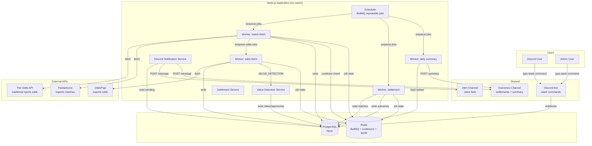
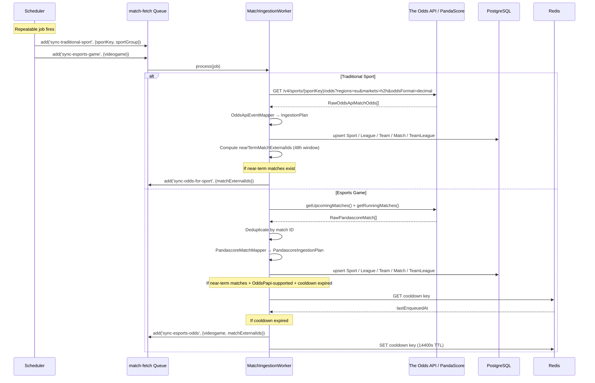
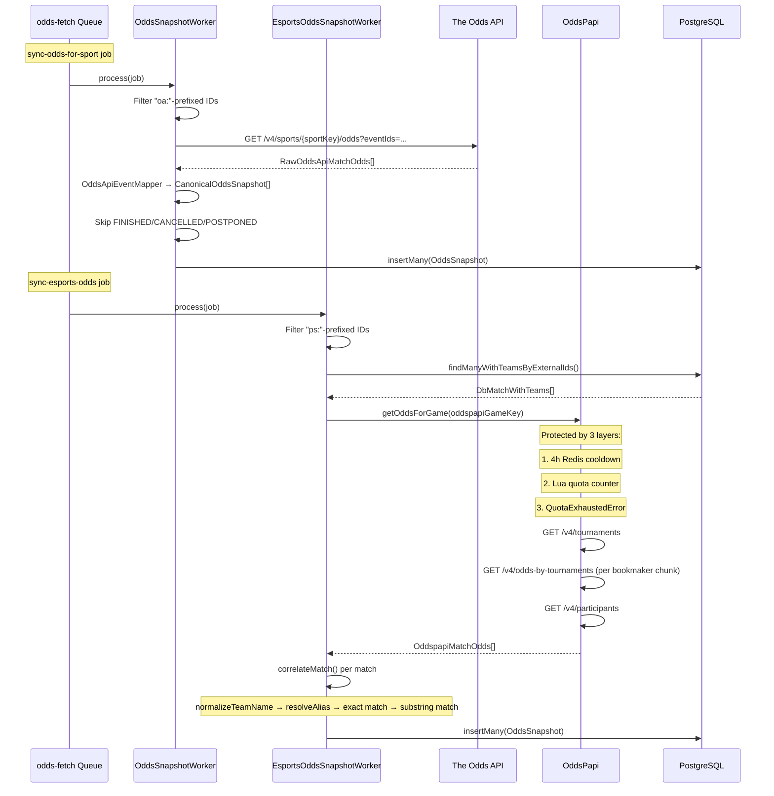
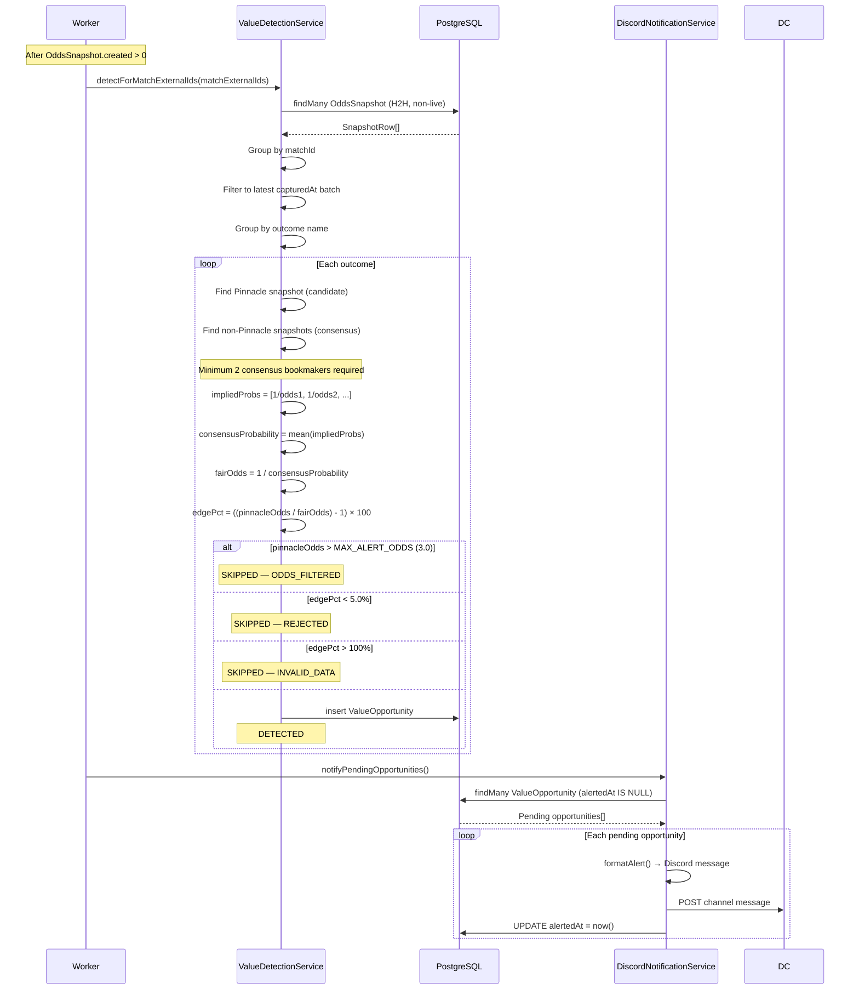
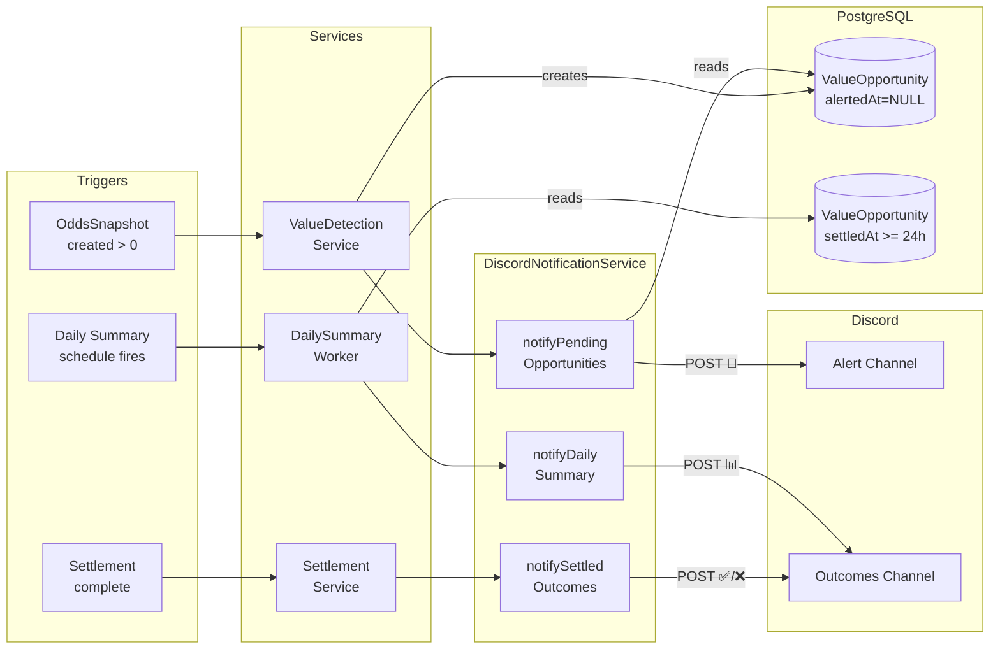
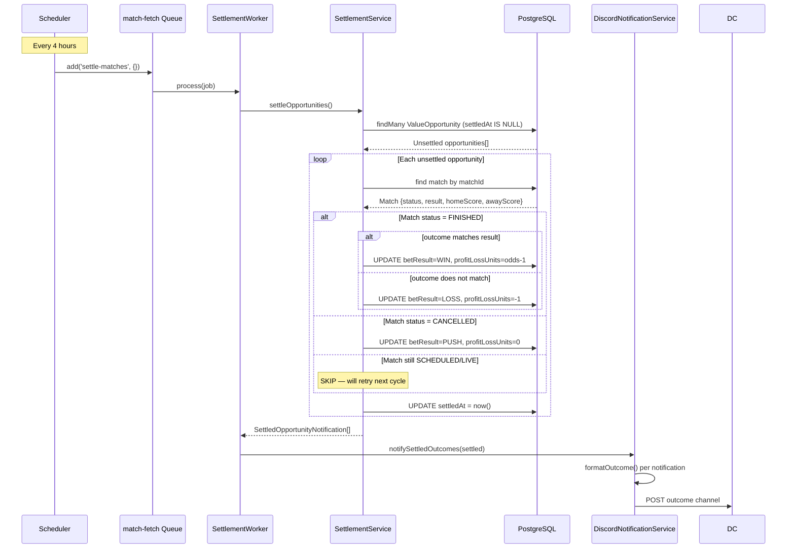
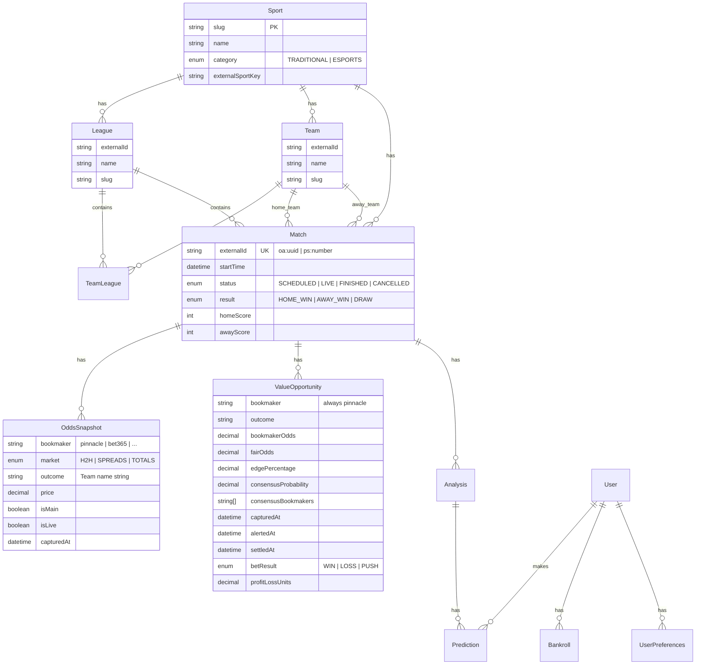
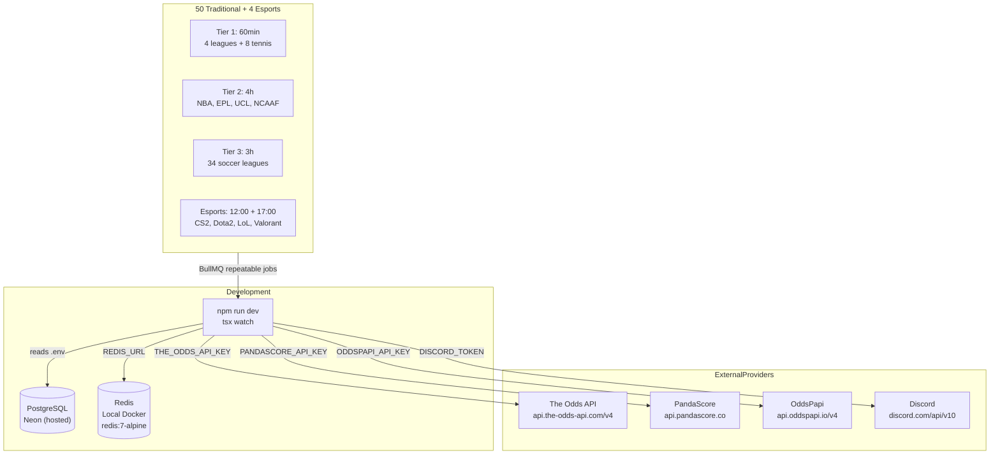

# Betting Intelligence — System Architecture Diagram

**Date:** 2026-06-08  
**Purpose:** Complete visual architecture for the Betting Intelligence platform  

---

## 1. High-Level Architecture



---

## 2. Component Table

| Component | Responsibility | Data Source | Output |
|---|---|---|---|
| **Scheduler** | Registers BullMQ repeatable jobs at startup | Hardcoded config in `app.ts` | BullMQ repeatable job definitions |
| **MatchIngestionWorker** | Fetches matches + odds from The Odds API / PandaScore | The Odds API, PandaScore | Match, Team, League, Sport, TeamLeague records |
| **OddsSnapshotWorker** | Fetches filtered odds by match IDs | The Odds API | OddsSnapshot records |
| **EsportsOddsSnapshotWorker** | Fetches esports odds from OddsPapi, correlates by team name | OddsPapi, PostgreSQL | OddsSnapshot records |
| **ReferenceDataWorker** | Syncs active sports list | The Odds API `/v4/sports` | Sport, League records |
| **ValueDetectionService** | Computes consensus probability, fair odds, edge, filters longshots | OddsSnapshot (PostgreSQL) | ValueOpportunity records |
| **SettlementWorker** | Checks finished matches, resolves bet outcomes | PostgreSQL (Match + The Odds API scores) | ValueOpportunity.settledAt, .betResult, .profitLossUnits |
| **DailySummaryWorker** | Aggregates 24h settled bets, calculates win rate + ROI | PostgreSQL (ValueOpportunity) | Discord message to outcomes channel |
| **DiscordNotificationService** | Sends value alerts, settlement outcomes, daily summaries | PostgreSQL (ValueOpportunity) | Discord HTTP REST POST |
| **DiscordBotService** | WebSocket bot for slash commands | PostgreSQL, Redis, BullMQ | Discord interaction replies |
| **OddspapiQuotaTracker** | Atomic Redis Lua counter for monthly OddsPapi calls | Redis | Throws `QuotaExhaustedError` at limit |
| **Health Server** | GET /health endpoint with DB + Redis + queue status | PostgreSQL, Redis, BullMQ | JSON health response |

---

## 3. Match Ingestion Flow



---

## 4. Odds Ingestion Flow



---

## 5. Value Detection Flow



---

## 6. Notification Flow



---

## 7. Settlement Flow



---

## 8. Database Table Overview



### Key Relationships

| Parent | Child | Cardinality | FK Field |
|---|---|---|---|
| Sport | League | 1:N | `sportId` |
| Sport | Team | 1:N | `sportId` |
| League | TeamLeague | 1:N | `leagueId` |
| Team | TeamLeague | 1:N | `teamId` |
| Sport | Match | 1:N | `sportId` |
| League | Match | 1:N | `leagueId` |
| Team (home) | Match | 1:N | `homeTeamId` |
| Team (away) | Match | 1:N | `awayTeamId` |
| Match | OddsSnapshot | 1:N | `matchId` |
| Match | ValueOpportunity | 1:N | `matchId` |

---

## 9. API Dependency Table

| API | Endpoints Used | Purpose | Criticality | Monthly Quota |
|---|---|---|---|---|
| **The Odds API** | `GET /v4/sports`, `GET /v4/sports/{key}/odds`, `GET /v4/sports/{key}/scores` | Traditional sports match data + odds + results | **Critical** — no traditional sports without it | 500 (free) / ~20,000 (paid) |
| **PandaScore** | `GET /{videogame}/matches/upcoming`, `GET /{videogame}/matches/running` | Esports match discovery | **Critical** — no esports matches without it | Varies (no built-in tracking) |
| **OddsPapi (api.oddspapi.io)** | `GET /v4/tournaments`, `GET /v4/odds-by-tournaments`, `GET /v4/participants` | Esports odds (Pinnacle only) | **Important** — without it, no esports value bets | 10,000 (hard limit) |
| **Discord REST API** | `POST /channels/{id}/messages` | Send alerts, outcomes, summaries | **Important** — no user-facing alerts without it | 50 messages/second (guild) |
| **Discord WebSocket Gateway** | Login + interaction events | Slash command handling | **Nice to have** — login failure is non-fatal | N/A |

---

## 10. How a Value Bet Is Created (Step-by-Step)

```

Step 1: Scheduler Fires
        sync-traditional-sport(soccer_epl) fires every 4h
        or sync-esports-game(cs2) fires at 12:00/17:00 Budapest

Step 2: Match Ingestion
        Worker calls The Odds API or PandaScore
        Maps raw API data → canonical entities
        Upserts: Sport → League → Team → Match → TeamLeague

Step 3: Odds Enqueue
        If near-term matches exist (startTime within 48h):
        → enqueue sync-odds-for-sport (5s delay)
        or sync-esports-odds (subject to 4h cooldown)

Step 4: Odds Fetched
        Worker calls The Odds API with eventIds filter
        or OddsPapi with tournament IDs
        Maps bookmaker/market/outcome triples → CanonicalOddsSnapshot

Step 5: OddsSnapshot Stored
        insertMany(OddsSnapshot) → PostgreSQL
        Each snapshot: {matchId, bookmaker, market, outcome, price, capturedAt}

Step 6: Value Detection Triggered
        If oddsSnapshots.created > 0:
        → ValueDetectionService.detectForMatchExternalIds()

Step 7: Consensus Calculated
        Reads ALL OddsSnapshots for these matches (H2H, non-live)
        Groups by matchId → filters latest batch → groups by outcome
        For each outcome:
          pinnacleSnaps = [Pinnacle price]
          consensusSnaps = [all other bookmaker prices]

Step 8: Fair Odds Generated
        impliedProbs = [1/odds for each consensus bookmaker]
        consensusProbability = mean(impliedProbs)
        fairOdds = 1 / consensusProbability

Step 9: Edge Calculated
        edgePct = ((pinnacleOdds / fairOdds) - 1) × 100

Step 10: Filters Applied
        ① MAX_ALERT_ODDS check (3.0): pinnacleOdds > 3.0 → SKIP
        ② MIN_EDGE check (5%): edgePct < 5% → REJECTED
        ③ MAX_EDGE check (100%): edgePct > 100% → SKIP (data quality)

Step 11: ValueOpportunity Created
        insert ValueOpportunity {matchId, sport, bookmaker, outcome,
        bookmakerOdds, fairOdds, edgePercentage, consensusProbability}

Step 12: Discord Notification Sent
        notifyPendingOpportunities() reads all alertedAt=NULL records
        For each: formatAlert() → POST to Discord Alert Channel
        UPDATE alertedAt = now()
```

---

## 11. How a Settlement Is Created (Step-by-Step)

```

Step 1: Scheduler Fires
        settle-matches fires every 4h

Step 2: Unsettled Opportunities Queried
        SELECT * FROM ValueOpportunity WHERE settledAt IS NULL

Step 3: Match Status Checked
        For each unsettled opportunity:
          SELECT status, result FROM Match WHERE id = matchId

Step 4: Outcome Determined

        Match FINISHED:
          outcome == match.result   → betResult = WIN
                                     profitLossUnits = bookmakerOdds - 1
          outcome ≠ match.result   → betResult = LOSS
                                     profitLossUnits = -1

        Match CANCELLED:
                                     betResult = PUSH
                                     profitLossUnits = 0

        Match SCHEDULED/LIVE:
                                     SKIP (retry next cycle)

Step 5: ValueOpportunity Updated
        UPDATE settledAt = now()
        UPDATE betResult = WIN|LOSS|PUSH
        UPDATE profitLossUnits = calculated value

Step 6: Outcome Notifications Sent
        notifySettledOutcomes() formats each as:
        ✅ WIN / ❌ LOSS / ⚪ VOID
        POST to Discord Outcomes Channel
```

---

## 12. Current Infrastructure



### Infrastructure Details

| Component | Technology | Connection | Persistence |
|---|---|---|---|
| **Application** | Node.js + TypeScript + pnpm | Local | N/A |
| **Database** | PostgreSQL via Neon (serverless) | `DATABASE_URL` | **Persistent** — all business data |
| **Cache/Queue** | Redis 7 (local Docker) | `REDIS_URL=redis://localhost:6379` | Ephemeral — job state, cooldowns, quota counter |
| **Queue Framework** | BullMQ 4.x on Redis | Shared Redis connection | Ephemeral — recreated on restart |
| **Discord Bot** | discord.js (WebSocket + REST) | `DISCORD_TOKEN` | N/A |

---

## 13. Complete System Diagram

```mermaid
graph TB
    subgraph External
        OA[The Odds API]
        PS[PandaScore]
        OP[OddsPapi]
        DC[Discord API]
    end

    subgraph BullMQ["BullMQ Queues (Redis)"]
        Q_MF["match-fetch queue"]
        Q_OF["odds-fetch queue"]
        Q_AA["ai-analysis<br/>unused"]
    end

    subgraph Workers
        W_REF[ReferenceDataWorker]
        W_MI[MatchIngestionWorker]
        W_OS[OddsSnapshotWorker]
        W_EO[EsportsOddsSnapshotWorker]
        W_SETTLE[SettlementWorker]
        W_DS[DailySummaryWorker]
    end

    subgraph Services
        S_ODDS[OddsSnapshotIngestionService]
        S_ESP[EsportsOddsSnapshotIngestionService]
        S_VAL[ValueDetectionService]
        S_SETTLE[SettlementService]
        S_NOTIFY[DiscordNotificationService]
    end

    subgraph DB[("PostgreSQL (Neon)")]
        SP[Sport]
        LG[League]
        TM[Team]
        TL[TeamLeague]
        MC[Match]
        OS[OddsSnapshot]
        VO[ValueOpportunity]
    end

    subgraph Discord
        BOT[DiscordBotService<br/>slash commands]
        ALERTS[Alert Channel]
        OUTCOMES[Outcomes Channel]
    end

    subgraph Redis
        RQ[BullMQ state]
        CD[Cooldown keys<br/>4h per esport]
        QT[Quota counter<br/>OddsPapi monthly]
    end

    %% Scheduler → Queues
    SCHED --> Q_MF
    SCHED --> Q_AA

    %% Queue → Workers
    Q_MF --> W_REF
    Q_MF --> W_MI
    Q_MF --> W_SETTLE
    Q_MF --> W_DS
    Q_OF --> W_OS
    Q_OF --> W_EO

    %% Workers → APIs
    W_REF --> OA
    W_MI --> OA
    W_MI --> PS
    W_EO --> OP

    %% Workers → Services
    W_OS --> S_ODDS
    W_EO --> S_ESP
    W_OS --> S_VAL
    W_EO --> S_VAL
    W_OS --> S_NOTIFY
    W_EO --> S_NOTIFY
    W_SETTLE --> S_SETTLE
    W_SETTLE --> S_NOTIFY
    W_DS --> S_NOTIFY

    %% Services → DB
    S_ODDS --> OS
    S_ESP --> OS
    S_VAL --> VO
    S_SETTLE --> VO
    S_NOTIFY --> VO
    W_MI --> SP
    W_MI --> LG
    W_MI --> TM
    W_MI --> TL
    W_MI --> MC
    W_REF --> SP
    W_REF --> LG

    %% Redis for workers
    W_MI --> CD
    W_EO --> QT
    W_MI -.-> RQ
    W_OS -.-> RQ
    W_EO -.-> RQ
    W_SETTLE -.-> RQ

    %% Discord
    S_NOTIFY -->|POST 🎯| ALERTS
    S_NOTIFY -->|POST ✅/❌| OUTCOMES
    S_NOTIFY -->|POST 📊| OUTCOMES
    BOT -->|read| DB
    BOT -->|read| Redis

    subgraph Scheduler["Scheduler (app.ts start)"]
        SCHED[scheduleIngestionJobs]
    end
```

---

## 14. Scheduled Jobs Reference

| Job | Queue | Schedule | Worker |
|---|---|---|---|
| `sync-reference-data` | match-fetch | Every 24h | ReferenceDataWorker |
| `sync-traditional-sport` | match-fetch | Per-key (60 min / 3h / 4h) | MatchIngestionWorker |
| `sync-esports-game` | match-fetch | 12:00, 17:00 Budapest | MatchIngestionWorker |
| `sync-odds-for-sport` | odds-fetch | Triggered (5s delay) | OddsSnapshotWorker |
| `sync-esports-odds` | odds-fetch | Triggered (4h cooldown) | EsportsOddsSnapshotWorker |
| `settle-matches` | match-fetch | Every 4h | SettlementWorker |
| `daily-summary` | match-fetch | 23:00 Budapest | DailySummaryWorker |

### Traditional Sports (50 total)

| Tier | Interval | Count | Example Keys |
|---|---|---|---|
| Tier 1 (60 min) | 60 min | 12 | NHL, MLB, WNBA, MLS + 8 tennis tournaments |
| Tier 2 (4h) | 4h | 4 | NBA, EPL, UCL, NCAAF |
| Tier 3 (3h) | 3h | 34 | 34 soccer leagues (Brazil, Germany, Italy, Spain, etc.) |

### Esports (4)

| Game | Schedule | PandaScore Slug | OddsPapi Key |
|---|---|---|---|
| CS2 | 12:00 + 17:00 | csgo | cs2 |
| Dota 2 | 12:00 + 17:00 | dota2 | dota2 |
| League of Legends | 12:00 + 17:00 | lol | lol |
| Valorant | 12:00 + 17:00 | valorant | valorant |

---

## 15. External Configuration Reference

### Environment Variables

| Variable | Required | Purpose |
|---|---|---|
| `NODE_ENV` | Yes | `development` or `production` |
| `LOG_LEVEL` | No | Default: `info` |
| `PORT` | No | Health server port (default 3000) |
| `DATABASE_URL` | Yes | Neon PostgreSQL pooled connection |
| `DIRECT_DATABASE_URL` | Yes | Direct connection for migrations |
| `REDIS_URL` | Yes | Local Docker Redis |
| `DISCORD_TOKEN` | Yes | Discord bot token |
| `DISCORD_CLIENT_ID` | Yes | Discord app ID |
| `DISCORD_GUILD_ID` | Yes | Discord guild ID |
| `DISCORD_ALERT_CHANNEL_ID` | Yes | Alert channel ID |
| `DISCORD_OUTCOMES_CHANNEL_ID` | No | Outcomes channel ID |
| `THE_ODDS_API_KEY` | Yes | The Odds API key |
| `PANDASCORE_API_KEY` | Yes | PandaScore API key |
| `DEEPSEEK_API_KEY` | Yes | Future use |
| `ODDSPAPI_API_KEY` | Yes | OddsPapi API key |
| `BETTING_DEFAULT_BANKROLL` | No | Default 10000 |
| `BETTING_MAX_CONCURRENT_BETS` | No | Default 10 |
| `BETTING_ANALYSIS_BUDGET_DAILY` | No | Default 50 |
| `MAX_ALERT_ODDS` | No | Default 3.0 |